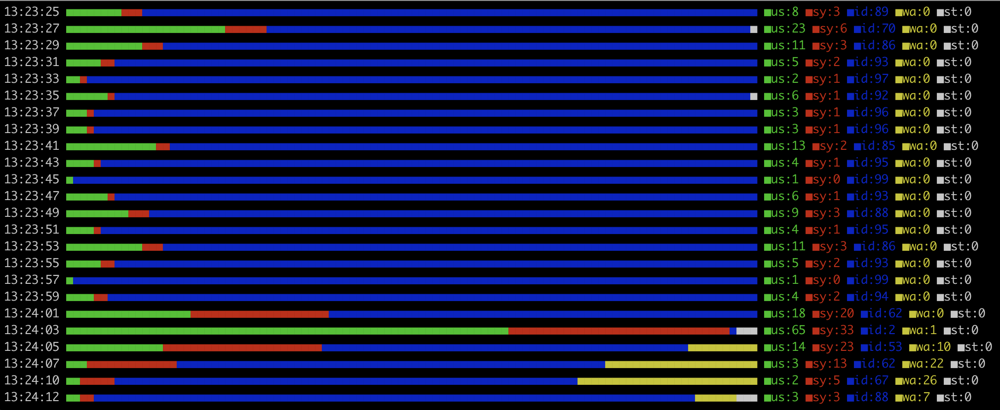

# Display vmstat "cpu" in real-time graphs

On Linux, when you want to check the CPU and memory load, you use vmstat. However, it would be nice to have it graphed later, but when you want to see it in real-time, it's not very intuitive with just numbers.

```
procs -----------memory---------- ---swap-- -----io---- -system-- ------cpu-----
 r  b   swpd   free   buff  cache   si   so    bi    bo   in   cs us sy id wa st
 1  1      0 2686216 764412 2112940    0    0     0 12016 3586 1495  0  1 75 24  0
 0  1      0 2682528 764452 2112952    0    0     0 44439 6167 6558  1  4 73 23  0
 0  1      0 2683336 764452 2112936    0    0     0 12016 3644 1478  1  0 77 22  0
 1  0      0 2653508 764456 2112972    0    0     4 44136 6706 7010  6  5 75 15  0
 0  1      0 2671148 764456 2112984    0    0     0 44132 5370 4269  2  5 71 22  0
 ```
So I created a command called cpugraph, which is limited to CPU usage, but displays the graph in real-time on the console.

<div align="center">
  
</div>

You can use it by simply placing the binary on the server and giving it execute permission.  
Please download the binary from the [Release page](https://github.com/knziiy/cpugraph/releases).

```shell
$ mv cpugraph.x86_64 cpugraph
$ chmod 755 cpugraph
$ ./cpugraph
```

When executed, it will repeatedly run vmstat 1 2 by default, parse the results, and display the CPU load in the number and color of the squares. (Sometimes the number of st is wrong because vmstat doesn't always return a total of 100)

It can take two numeric arguments: the first is the value to put in X of vmstat 1 X (default is 2), and the second is the number of squares displayed in the graph (default is 100).
If your terminal is narrow, setting it to about 50 will make it look nice.

```shell
$ ./cpugraph 2 50
```

## Author & License

* knziiy
* License:  
  MIT (see LICENSE)
  
